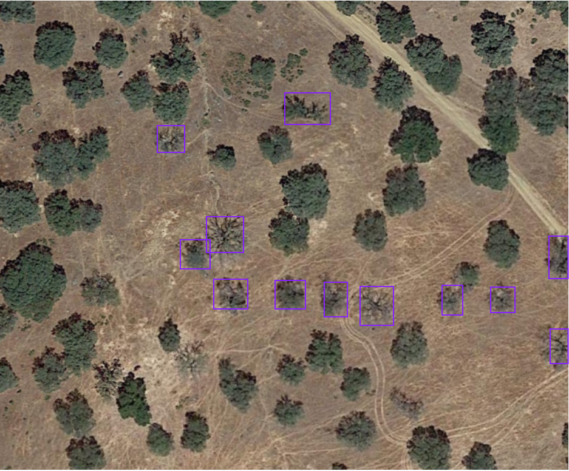
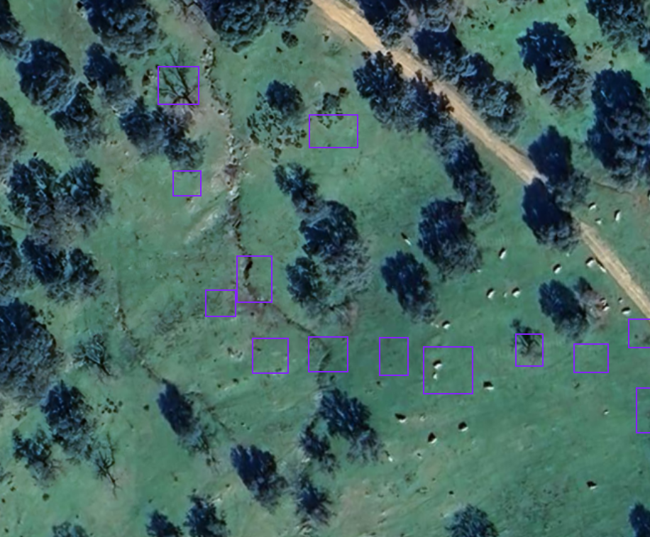

# QuercusHealth AI: Protecting the Dehesa through Predictive Intelligence

**An automated AI and satellite imagery platform designed to detect and predict the spread of *La Seca* in Mediterranean oak savannas.**

---

## 🌍 The Problem: An Invisible Threat 

The Spanish Dehesa is a unique 5-million-hectare ecosystem that sustains wildlife, agriculture, and a centuries-old way of life. Today, it faces an existential threat: ***La Seca*** (*Phytophthora cinnamomi*).

This aggressive root-rot pathogen spreads silently underground, starving *Quercus* oaks of water and nutrients. By the time a tree shows visible symptoms—like a thinning, radiating crown in the summer—it is often too late to save it, and the disease has already spread to neighboring roots.

Currently, monitoring this disease relies on slow, expensive manual field surveys. Landowners and administrators lack the real-time data needed to isolate outbreaks and protect their *fincas* (farms).

---

## 🚀 The Solution: QuercusHealth Platform

QuercusHealth is built from the ground up to be a **predictive SaaS monitoring platform**. By combining high-resolution satellite imagery (0.15m/px) with advanced deep learning (RetinaNet), we provide landowners with actionable intelligence to manage their estates.

Instead of walking thousands of hectares, users will be able to:
1. **Identify Sick Trees Early:** Detect the specific visual signatures of *La Seca* from above.
2. **Track Disease Spread:** Monitor the progression of the pathogen across their *finca* over time.
3. **Predict Outbreaks:** Use historical data to forecast which areas of the farm are most vulnerable next.

---

## 🔍 How It Works: Visualizing Mortality 

To train our AI, we rely on **multi-temporal validation**. We don't just look at a tree once; we track it over years to confirm its fate without ever stepping foot on the ground. 

Here is a real example of our annotated training data from the Dehesa:

### **Before: Summer 2019 (Early Symptoms)**
The image below shows a *Quercus* oak with a thinning, radiating crown during the dry season. This specific signature is the hallmark of *La Seca*.

### **After: February 2024 (Confirmed Dead)**
Five years later, the same location shows no active canopy. The tree is dead. This temporal confirmation allows us to label the 2019 image as a positive case of *La Seca* with high confidence, providing ultra-clean data for our neural networks.

---

## 🛠️ The Technology Engine

Building a reliable environmental health monitor requires scale and precision. Our current MVP achieves this through:

- **Automated Data Pipelines:** Custom PyAutoGUI & OpenCV engines capable of scraping and stitching thousands of high-resolution satellite tiles automatically.
- **Deep Learning Core:** Utilizing *DeepForest* architectures (RetinaNet with a ResNet-50 backbone) adapted specifically from generic North American forests to the sparse, Mediterranean Dehesa ecosystem.
- **Statistical Rigor:** Domain shifts and model confidence are continually optimized using advanced statistical gating (KS tests, Mann-Whitney U) to ensure false positives remain low.

---

## 📈 Roadmap to Launch

We are currently transitioning from our successful **Phase 2 Zero-Shot Baseline** (which proved our models can detect Dehesa crowns) into **Phase 3 Fine-Tuning**, where the AI is learning the specific disease signatures of *La Seca*. 

The end goal is a fully integrated web platform where any *finca* owner can draw a polygon on a map and receive a complete, AI-generated health audit of their entire estate.
