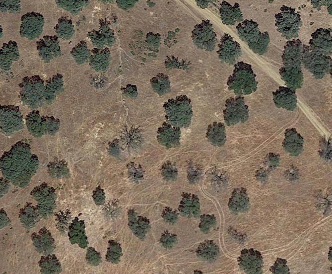
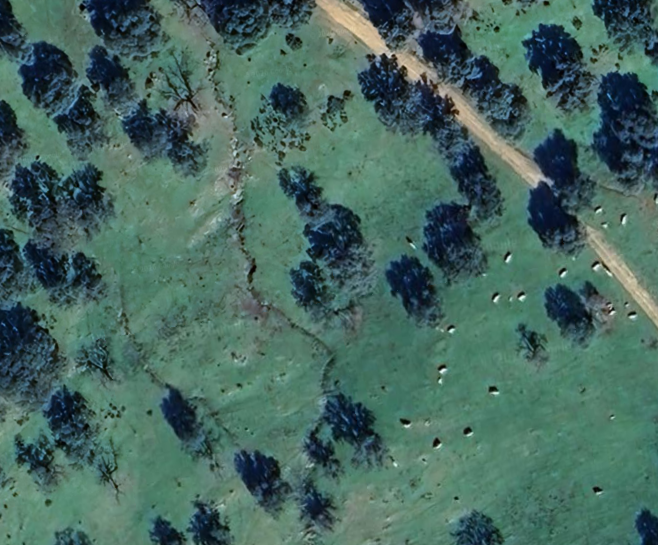

# QuercusHealth AI

**Automated tree detection and *La Seca* disease classification in the Spanish Dehesa using Deep Learning.**


---

## Overview

The Spanish Dehesa is a unique agro-sylvo-pastoral ecosystem dominated by *Quercus* oak trees.
*La Seca* (*Phytophthora cinnamomi*) is a root-rot disease that kills oaks at landscape scale across Extremadura and Andalucía.

This project builds an automated pipeline to:
1. Capture satellite imagery of Dehesa areas via Google Earth Pro.
2. Detect oak trees using a pre-trained [DeepForest](https://deepforest.readthedocs.io/) model (RetinaNet + ResNet-50 + FPN).
3. Classify each tree as **Healthy** or **Dead (La Seca)** using temporally validated annotations.

| | August 2019 | February 2024 |
|--|--|--|
| |  |  |
| | Early La Seca — thin radiating crown visible in summer | Same tree absent — confirmed dead. Zero field visits. |

### Baseline results (Phase 2 — zero-shot evaluation on 14 annotated Dehesa tiles)

| Metric | NEON benchmark | Dehesa zero-shot | Drop |
|--------|---------------|-----------------|------|
| Precision | 0.73 | — | — |
| Recall    | 0.63 | — | — |
| F1        | 0.68 | — | — |

> Run `02_annotation_evaluation.ipynb` to fill in the Dehesa column with real results.

Domain shift confirmed. Phase 3 fine-tunes on annotated Dehesa data. Target: **F1 > 0.60**.

---

## Project Structure

```
QuercusHealth-Public/
├── data/
│   ├── test/
│   │   ├── images/         # 14 annotated Dehesa tiles (committed, ~2 MB)
│   │   └── _annotations.csv# Ground truth — DeepForest CSV format (Tree / Seca)
│   ├── sample_2019aug.png  # Illustrative: summer 2019 — La Seca symptoms
│   └── sample_2024feb.png  # Illustrative: 2024 — confirmed dead tree
├── data_scrape/            # Capture scripts; 1,600 tiles are gitignored (local only)
├── models/                 # Weights auto-downloaded by DeepForest (gitignored)
├── notebooks/              # Main entry point — run in order
│   ├── 01_architecture_and_domain_shift.ipynb
│   └── 02_annotation_evaluation.ipynb
├── scripts/                # Data acquisition and evaluation utilities
├── .env.example            # Template for API credentials
└── requirements.txt
```

---

## Getting Started

### 1. Clone & install

```bash
git clone https://github.com/<your-user>/QuercusHealth-Public.git
cd QuercusHealth-Public
python -m venv .venv
source .venv/bin/activate        # Windows: .venv\Scripts\activate
pip install -r requirements.txt
```

### 2. Credentials (optional)

The notebooks run without any API key — the 14 annotated test images are already committed in `data/test/`.

If you want to download the full dataset from Roboflow:

```bash
cp .env.example .env
# Edit .env and paste your Roboflow API key
# Get yours at: https://app.roboflow.com/settings/api
python scripts/evaluate_baseline.py
```

### 3. Run the notebooks

```bash
jupyter notebook
```

| Notebook | What it does |
|----------|-------------|
| `01_architecture_and_domain_shift.ipynb` | Inspects DeepForest architecture, runs zero-shot on NEON and 14 Dehesa tiles, proves domain shift statistically (KS test + Mann-Whitney U), sweeps hyperparameters |
| `02_annotation_evaluation.ipynb` | Uses ground-truth annotations to compute Precision/Recall/F1, score_thresh sweep with real metrics, temporal La Seca validation, Phase 3 roadmap |

Run **01 first**, then **02**. DeepForest downloads model weights automatically on first run (~400 MB).

---

## Scripts

| Script | Description |
|--------|-------------|
| `scripts/scanner.py` | Captures a screenshot grid from Google Earth Pro via PyAutoGUI. Zig-zag traversal, configurable grid and region. |
| `scripts/scanner_ge.py` | Legacy scanner using Google Earth's native export dialog (Ctrl+Alt+S). |
| `scripts/stitcher.py` | Stitches PNG tiles into a seamless mosaic using OpenCV (SCANS mode). |
| `scripts/evaluate_baseline.py` | Standalone evaluation: downloads from Roboflow, converts labels, evaluates, saves prediction overlays. Requires `.env`. |

```bash
# Capture satellite tiles (edit ROWS/COLS first)
python scripts/scanner.py

# Stitch into mosaic
python scripts/stitcher.py
```

Captured tiles are saved to `data_scrape/captures/` (gitignored — too large for GitHub).

---

## Tech Stack

- **Model**: [DeepForest](https://deepforest.readthedocs.io/) — RetinaNet (ResNet-50 + FPN), pre-trained on NEON aerial imagery
- **Annotations**: [Roboflow](https://universe.roboflow.com/sergios-workspace-svg91/quercushealth-dehesa) — 14 tiles, 210 bounding boxes, 2 classes
- **Training framework**: PyTorch + PyTorch Lightning
- **Image capture**: PyAutoGUI + OpenCV
