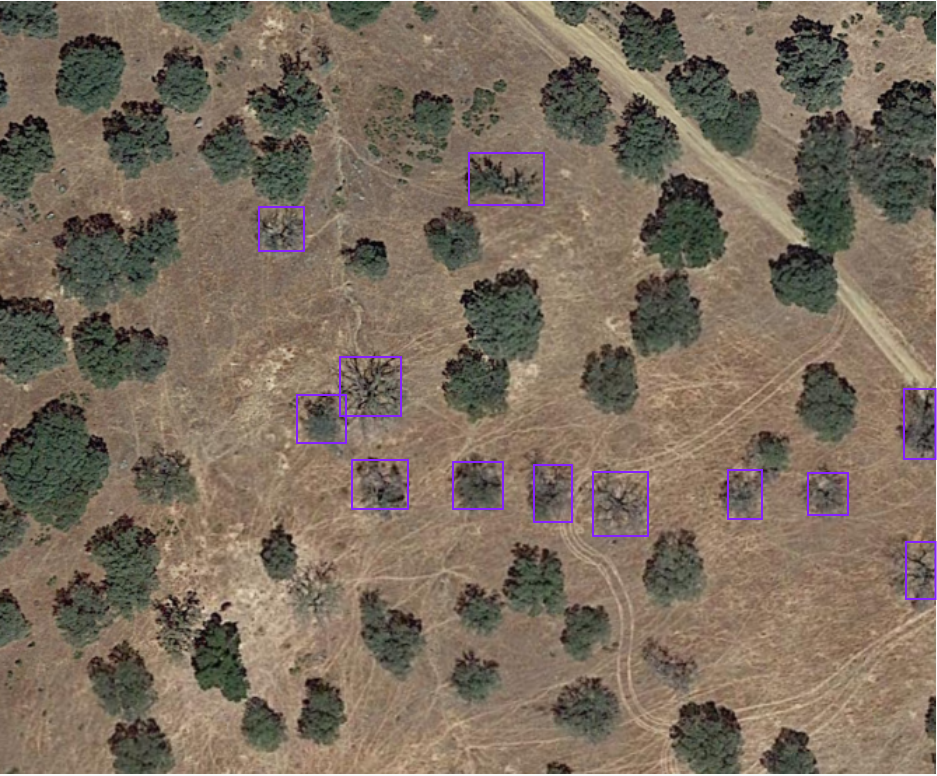
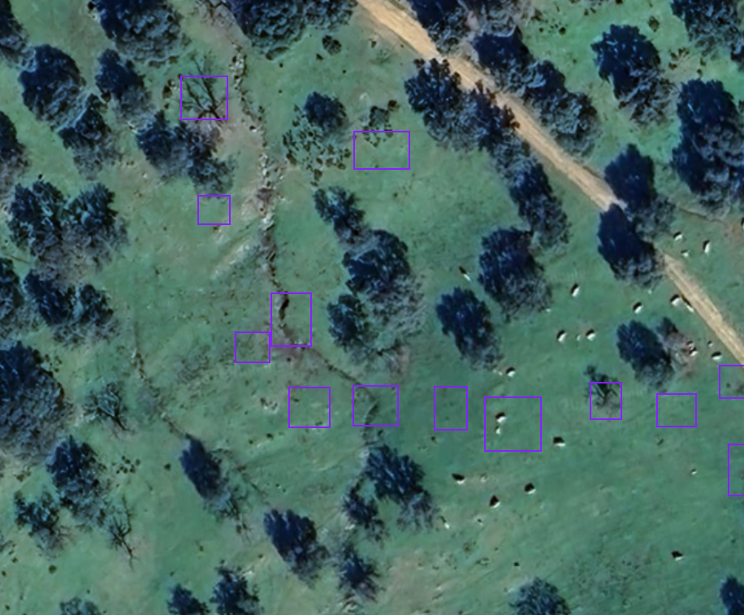

# QuercusHealth AI

Automated detection and health classification of *Quercus ilex* in the Spanish Dehesa using domain-adapted aerial imagery and deep learning.

**Course:** ITMD-524 Applied AI & Deep Learning, Spring 2026  
**Author:** Sergio Illescas Cabiro  
**Institution:** Illinois Institute of Technology  
**Paper:** [`report/main.pdf`](report/main.pdf)  
**Model weights:** [sillescas/deepforest-dehesa-quercus](https://huggingface.co/sillescas/deepforest-dehesa-quercus)

---

## The Problem

The Spanish Dehesa is a unique 5-million-hectare ecosystem that sustains wildlife, agriculture, and a centuries-old way of life. Today, it faces an existential threat: ***La Seca*** (*Phytophthora cinnamomi*).

This aggressive root-rot pathogen spreads silently underground, starving *Quercus ilex* oaks of water and nutrients. By the time a tree shows visible symptoms - a thinning, radiating crown during the dry season - it is often too late to save it, and the disease has already spread to neighboring roots.

Currently, monitoring relies on slow, expensive manual field surveys. Landowners lack the data needed to isolate outbreaks early.

---

## Multi-Temporal Ground Truth

To train our models with high-confidence labels, we use **multi-temporal validation** — tracking individual trees across years to confirm their fate without field visits.

### Summer 2019 (Early Symptoms)

A *Quercus ilex* with a thinning, radiating crown during the dry season. This visual signature is characteristic of *La Seca* infection.



### February 2024 (Confirmed Dead)

The same location five years later shows no active canopy. The tree is dead. This temporal confirmation allows us to label the 2019 image as a positive case of *La Seca* with high confidence, providing clean training data for our neural networks.



---

## Approach

The project addresses the domain shift between pre-trained tree crown detectors (trained on North American temperate forests) and the Mediterranean Dehesa ecosystem through a 5-phase pipeline:

1. **Domain Shift Analysis** - Proves that zero-shot DeepForest fails on Dehesa imagery (KS test D=0.833, confidence drop 56%)
2. **Formal Evaluation** - Quantifies baseline: F1=0.320 on Dehesa vs 0.68 on native NEON data
3. **Fine-Tuning** - Domain-adapts DeepForest with hand-annotated Dehesa imagery (LR=1e-4, 30 epochs)
4. **Two-Stage Pipeline** - Decouples detection from classification: DeepForest detects all trees, ResNet-18 classifies health
5. **End-to-End Evaluation** - Combines 1-class detector + classifier with IoU-based matching for fully automated inference

---

## Results

| Phase | Description | F1 (All Classes) | F1 (Seca) |
|-------|-------------|:----------------:|:---------:|
| 2 | Zero-shot DeepForest baseline | 0.320 | 0.000 |
| 3 | Fine-tuned 2-class detector | 0.669 | 0.000 |
| 4 | Two-stage pipeline (GT crops) | 0.712 | 0.354 |
| 5 | End-to-end (1-class + classifier) | 0.636 | 0.346 |

Starting from a zero-shot F1 of 0.000 for Seca detection, the final system achieves F1=0.346 - establishing a meaningful baseline for automated disease monitoring.

Output figures for all phases are committed to `reports/` and `report/figures/`. Notebooks 01, 02, 02b, and 03 contain inline cell outputs as execution evidence. Notebooks 04 and 05 require GPU training to reproduce results.

---

## Repository Structure

```
notebooks/
  01_architecture_and_domain_shift.ipynb   # Phase 1: Zero-shot baseline + domain shift proof
  02_annotation_evaluation.ipynb           # Phase 2: Formal evaluation on annotated Dehesa data
  02b_preannotation.ipynb                  # Phase 2b: Semi-automated pre-annotation for Roboflow
  03_fine_tuning.ipynb                     # Phase 3: 2-class fine-tuning [executed, outputs embedded]
  04_two_stage_pipeline.ipynb              # Phase 4: Detection + ResNet-18 crop classifier [runnable]
  05_end_to_end.ipynb                      # Phase 5: 1-class detector + classifier e2e [runnable]

scripts/
  evaluate_baseline.py # Standalone zero-shot evaluation pipeline

data/
  test/                # 14 annotated test images with bounding box CSV
  sample_*.png         # Multi-temporal reference images (2019/2024, annotated)

data_scrape/
  scanner.py           # Google Earth Pro tile capture (PyAutoGUI, zig-zag grid)
  scanner_ge.py        # Legacy scanner using Google Earth export dialog
  stitcher.py          # Stitch captured tiles into a mosaic (OpenCV)
  captures/            # (gitignored) Raw PNG tiles (~2 GB)

models/
  README.md            # Points to HuggingFace for weight downloads

reports/
  *.png                # Output figures from all pipeline phases

report/
  main.pdf             # Full NeurIPS-format research paper (6 pages)
  main.tex             # LaTeX source
  references.bib       # Bibliography
```

---

## How to Run

### Prerequisites

- Python 3.10 or higher
- A CUDA-capable GPU is recommended for training (Phases 3-5). Inference runs on CPU.
- Google Earth Pro (only needed if re-running the data collection scanner)

### Installation

```bash
git clone https://github.com/sergioillescascabiro/QuercusHealth-Public.git
cd QuercusHealth-Public

python -m venv .venv
# Linux/macOS:
source .venv/bin/activate
# Windows:
.venv\Scripts\activate

pip install -r requirements.txt
```

> **Note on PyTorch + CUDA:** If you have a CUDA GPU, install the matching torch version first:
> ```bash
> pip install torch torchvision --index-url https://download.pytorch.org/whl/cu124
> pip install deepforest
> ```
> DeepForest may downgrade torch; re-install the CUDA version afterwards if needed.

### Dataset

The annotated test split (14 images) is included in `data/test/`. The full training dataset is hosted on Roboflow.

**Direct download (no account required):**  
[https://app.roboflow.com/ds/lhbhwAM9HN?key=xqoQlM4K1Y](https://app.roboflow.com/ds/lhbhwAM9HN?key=xqoQlM4K1Y)

**For notebook auto-download via the Roboflow API:**
1. Copy `.env.example` to `.env`
2. Fill in your Roboflow API key and workspace name (see `.env.example`)
3. The notebooks download the dataset automatically at runtime

Dataset details:
- **Project**: `quercushealth-dehesa-summer2019` (version 1)
- **Format**: Pascal VOC (used by DeepForest)
- **Train**: 243 images · **Val**: 18 · **Test**: 17
- **Classes**: `Healthy` (6,449 annotations), `Seca` (892 annotations)

### Pre-trained Model Weights

Model weights are hosted on HuggingFace (too large for git):  
[sillescas/deepforest-dehesa-quercus](https://huggingface.co/sillescas/deepforest-dehesa-quercus)

| File | Phase | Architecture | Size |
|------|-------|-------------|------|
| `deepforest_dehesa_finetuned.pt` | 3 | RetinaNet + ResNet-50 | 257 MB |
| `stage2_classifier.pt` | 4/5 | ResNet-18 crop classifier | 45 MB |

The notebooks download weights automatically at runtime via the HuggingFace Hub.

### Reproduction Steps

Run the notebooks in order (`jupyter lab` or `jupyter notebook`). Each notebook is self-contained and saves its outputs to `reports/`.

```
01_architecture_and_domain_shift.ipynb
    Zero-shot DeepForest on NEON benchmark and Dehesa images.
    Hyperparameter sweeps proving domain shift cannot be fixed by tuning.
    Statistical tests: KS D=0.833, Mann-Whitney p<0.0001.

02_annotation_evaluation.ipynb
    Formal evaluation with hand-annotated Dehesa images from Roboflow.
    Result: F1=0.320 on Dehesa vs 0.68 on native NEON data.

02b_preannotation.ipynb
    Semi-automated pre-annotation: runs zero-shot model on 324 tiles,
    uploads predictions to Roboflow for human review.

03_fine_tuning.ipynb  [executed -- outputs embedded]
    Fine-tunes DeepForest for 2-class detection (Healthy/Seca).
    LR=1e-4, 30 epochs, batch_size=4 on GPU (RTX 3060).
    Result: F1=0.669 overall, F1-Seca=0.000.
    Includes ablation: LR=1e-2 causes catastrophic forgetting (F1=0.0).

04_two_stage_pipeline.ipynb
    Stage 1: DeepForest detects all trees (detection only).
    Stage 2: ResNet-18 classifies 96x96 crops (Healthy vs Seca).
    WeightedRandomSampler + class-weighted CrossEntropy for imbalance.
    Result: F1-Seca=0.354 on GT crops, F1-Overall=0.712.

05_end_to_end.ipynb
    1-class tree detector + Phase 4 classifier evaluated end-to-end.
    IoU-based matching of predicted boxes to ground truth.
    Result: F1-Seca=0.346, F1-Overall=0.636.
```

---

## Dependencies

Full list in [`requirements.txt`](requirements.txt). Key packages:

| Package | Purpose |
|---------|---------|
| `deepforest` | Pre-trained RetinaNet tree crown detector |
| `torch`, `torchvision` | Deep learning (fine-tuning, ResNet-18 classifier) |
| `roboflow` | Dataset download and annotation management |
| `scipy`, `scikit-learn` | Statistical tests and evaluation metrics |
| `albumentations` | Image augmentation for training |
| `pyautogui`, `opencv-python` | Data collection automation |
| `geopandas`, `rasterio` | Geospatial data handling |

---

## Troubleshooting

**`CUDA out of memory` during Phase 3 training**  
Reduce batch size in the notebook config cell: `BATCH_SIZE = 2` (default is 4).

**`ROBOFLOW_API_KEY not found` error**  
Copy `.env.example` to `.env` and fill in your Roboflow API key and workspace name.

**DeepForest downgrades PyTorch after install**  
Re-run the CUDA-specific torch install after installing deepforest:
```bash
pip install torch torchvision --index-url https://download.pytorch.org/whl/cu124
```

**Notebook 04 or 05: `train.csv` not found**  
These CSVs are generated by notebook 03 (Phase 3) when it downloads the Roboflow dataset. Run 03 first.

**`ModuleNotFoundError: omegaconf`**  
Run `pip install omegaconf` or re-install all requirements: `pip install -r requirements.txt`.

---

## Paper

The full research paper is available at [`report/main.pdf`](report/main.pdf).

Illescas Cabiro, S. (2026). *QuercusHealth AI: Automated Detection and Health Classification of Quercus ilex in the Spanish Dehesa via Domain-Adapted Aerial Imagery*. Illinois Institute of Technology, ITMD-524.
